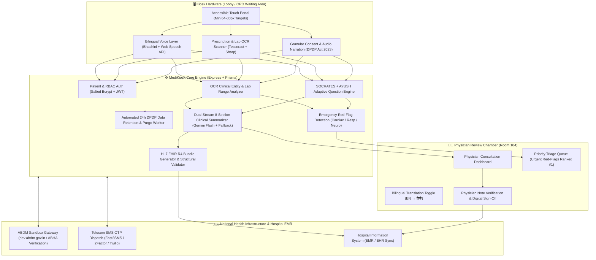

# 🏥 MediKiosk — Intelligent Outpatient Triage, Clinical Intake & ABDM Platform

[](https://opensource.org/licenses/MIT)
[](https://nodejs.org)
[](https://react.dev)
[](https://nrces.in)
[](https://abdm.gov.in)
[](https://www.meity.gov.in)

> **A hospital-grade self-service kiosk and physician review workspace designed for high-volume Indian government hospital outpatient departments (OPDs).**  
> MediKiosk combines bilingual voice dialogue, classical AYUSH Dashavidha Pariksha, real multilingual OCR document digitization, clinical drug-interaction detection, automated red-flag triage, and NRCES-compliant HL7® FHIR® R4 bundle generation.

---

## 🏛️ System Architecture



---

## 🎯 4-Module Hackathon Problem Statement Mapping

| Module | Hackathon Problem Statement | MediKiosk Technical Implementation |
|---|---|---|
| **Module A** | **Conversational Clinical Intake & Dual-Mode Voice** | • Adaptive SOCRATES questioning based on chief complaint.<br>• Classical AYUSH Dashavidha Pariksha (Prakriti, Agni, Koshtha).<br>• Pluggable Indian-Language Voice Architecture (Bhashini ASR/TTS + native fallback).<br>• Real-time red-flag detection prioritizing high-acuity patients. |
| **Module B** | **Document Digitization & Diagnostic Intelligence** | • Multilingual Tesseract OCR + Sharp image preprocessing.<br>• Extraction of medications, posology, radiology findings, and lab values.<br>• Clinical drug-drug interaction alerts (e.g. Aspirin + NSAID GI bleed warning).<br>• Standard clinical reference range evaluation (HIGH / LOW flags). |
| **Module C** | **Structured Clinical Summary & EMR Integration** | • Synthesizes conversational history + OCR findings into 8 standard clinical sections (CC, HPI, PMHx, MEDS, FSHx, PERSONAL, ROS, INV).<br>• NRCES-compliant HL7 FHIR R4 Bundle validation (`Composition`, `Patient`, `Condition`, `Observation`, `Consent`).<br>• Bilingual `[ EN \| हिंदी ]` physician toggle and digital verification note sign-off. |
| **Module D** | **ABDM Integration, Granular Consent & DPDP Act 2023** | • Real ABDM Sandbox Gateway integration (`https://dev.abdm.gov.in/gateway/v0.5`).<br>• Built-in Sandbox Simulator with universal demo OTP fallback (`123456`).<br>• Granular consent checkboxes (Data Capture, HIS Sharing, ABHA Linking).<br>• Revocable consent right-to-erasure endpoint (`POST /api/consent/revoke/:id`).<br>• Automated 24-hour raw text retention purge worker. |

---

## 🚀 Quickstart Guide

### Option 1: One-Command Docker Deployment (Recommended)

Start the entire platform (Frontend, Backend, Database volume) with a single command:

```bash
docker compose up --build
```

- **Kiosk Touch Portal**: `http://localhost:5173/kiosk`
- **Doctor Consultation Dashboard**: `http://localhost:5173/doctor`
- **Admin Diagnostics Panel**: `http://localhost:5173/admin`
- **Backend API**: `http://localhost:3000/api/health`

---

### Option 2: Local Development Setup

#### Prerequisites
- **Node.js**: v18.0.0 or higher
- **npm**: v9.0.0 or higher

#### 1. Backend Setup
```bash
cd backend
npm install
npx prisma db push
npm run dev
```
*Backend runs on `http://localhost:3000` with SQLite database `dev.db`.*

#### 2. Frontend Setup
```bash
cd frontend
npm install
npm run dev
```
*Frontend runs on `http://localhost:5173`.*

---

## 🧪 Automated Testing & Reliability Suite

MediKiosk includes a comprehensive automated test suite powered by **Vitest** and **React Testing Library**:

```bash
# Run all backend unit, integration, and clinical pipeline tests (15 Tests)
cd backend
npm test

# Run 20-concurrent-transaction SQLite stress check (Verifies zero dropped writes)
npm run test:stress

# Run frontend component tests and E2E clinical flow simulation (6 Tests)
cd frontend
npm test

# Verify production bundle build
npm run build
```

---

## 🔑 Environment Variable Reference Table

All external cloud services feature **zero-configuration automatic local fallbacks**. The platform runs 100% functional out of the box without any paid API keys!

| Variable | Required? | Default / Fallback Mode | Description |
|---|---|---|---|
| `GEMINI_API_KEY` | Optional | Deterministic Clinical Section Synthesizer | Google Gemini 2.5 Flash API key for synthesized clinical dossiers. |
| `BHASHINI_API_KEY` | Optional | Web Speech API (Browser Native Speech) | AI4Bharat / Digital India Bhashini Speech API key for Hindi/regional voice. |
| `BHASHINI_USER_ID` | Optional | — | Bhashini User ID for cloud ASR & TTS. |
| `ABDM_CLIENT_ID` | Optional | Local Sandbox Simulator | National Health Authority ABDM Sandbox Client ID. |
| `ABDM_CLIENT_SECRET` | Optional | Local Sandbox Simulator | National Health Authority ABDM Sandbox Client Secret. |
| `ABDM_BASE_URL` | Optional | `https://dev.abdm.gov.in/gateway/v0.5` | Gateway URL for ABDM NHA Sandbox. |
| `FAST2SMS_API_KEY` | Optional | Demo OTP Simulator (`123456`) | Fast2SMS API key for Indian telecom OTP dispatch. |
| `JWT_SECRET` | Optional | Built-in Secure Production Default | Secret used for signing Patient & Staff JWT tokens. |
| `DATABASE_URL` | Optional | `file:./dev.db` | Prisma SQLite database connection string. |

---

## ♿ Accessibility & Hallway Kiosk Standards

- **Target Sizing**: Minimum 64px to 80px touch target heights with high-contrast tactile outlines.
- **Typography**: High legibility typography with minimum 18px body copy and 24-26px button text.
- **Hallway Offline Safe Mode**:
  If the hospital server or local Wi-Fi drops, the kiosk automatically activates **Hallway Offline Safe Mode**, keeping the symptom intake operational on local cache without showing a broken or crashed screen. Tokens are safely queued and synced upon reconnection.

---

## ⚠️ Known Limitations & Future Hospital Roadmap

1. **Drug Interaction Dictionary**: The starter dictionary includes high-risk allopathic pairs (Aspirin + NSAIDs, ACE-Inhibitors + Potassium, Metformin + Contrast). For commercial production, integration with Medscape/CDSCO formulary databases is planned.
2. **ABDM Production Certification**: Operating in ABDM Sandbox mode. Full hospital deployment requires government M1/M2/M3 milestone security audits.
3. **SMS Telecom Dispatch**: Configured with live gateways (Fast2SMS/2Factor/Twilio); operates in visible demo mode (`123456`) when keys are absent.

---

## 📜 Consolidated 10-Phase PTCF Upgrade Changelog

- **Phase 0 — Comprehensive Architecture & Security Audit**: Baseline repository audit, vulnerability mapping, and upgrade roadmapping.
- **Phase 1 — Core Authentication, Passwords & RBAC**: Replaced plaintext passwords with salted bcrypt hashes (`$2a$`), introduced JWT verification, role-based access control (`DOCTOR`, `ADMIN`, `PATIENT`), rate limiting, and HTTP security headers (`Helmet`).
- **Phase 2 — Adaptive Dialogue & Clarifying Questions**: Added dynamic follow-up questioning for ambiguous patient responses with deterministic fallback.
- **Phase 3 — Indian-Language Voice Architecture**: Integrated AI4Bharat Bhashini Speech-to-Text and Text-to-Speech alongside browser speech fallback, real-time waveform visualizer, and silence recovery prompts.
- **Phase 4 — AYUSH Dashavidha Pariksha Intake**: Added Charaka Samhita-compliant Ayurvedic clinical assessment (Prakriti, Agni, Koshtha), clarifying dialogue, and dedicated Vaidya dossier.
- **Phase 5 — Red-Flag Detection & Priority Triage**: Automated detection of acute coronary syndromes, respiratory failure, and meningeal signs with instant `TRIAGE_URGENT` queue escalation.
- **Phase 6 — Multilingual OCR & Diagnostic Hardening**: Integrated native `sharp` preprocessing, Tesseract multilingual OCR, clinical drug-interaction scanner, and longitudinal patient document timeline.
- **Phase 7 — Dual Clinical Summary & FHIR Validation**: Synthesized conversational history and document findings into 8 clinical sections with bilingual `[ EN | हिंदी ]` toggle and NRCES-compliant HL7 FHIR R4 validation.
- **Phase 8 — ABDM/ABHA Sandbox & DPDP Consent Layer**: Built live ABDM sandbox authentication architecture, granular DPDP checkboxes, audio-guided consent narration, right-to-erasure endpoint, and automated 24h retention purge worker.
- **Phase 9 — Automated Testing & Reliability**: Added 15 Vitest backend tests, 6 frontend component/E2E tests, 20-concurrent-write SQLite stress check, and fixed document state bugs.
- **Phase 10 — Accessibility, Deployment & Demo Packaging**: Built Docker containerization (`Dockerfile` + `docker-compose.yml`), Hallway Offline Safe Mode, `DEMO_SCRIPT.md`, and master documentation.
